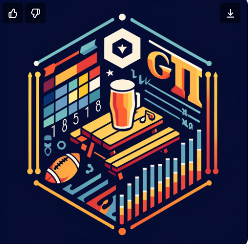

## tableService 

Custom styled gt themes to adorn your tables with a modern, polished look.

<!-- badges: start -->
[](https://lifecycle.r-lib.org/articles/stages.html#experimental)
<!-- badges: end -->

### About tableService

The `tableService` package makes it easy to create pre-formatted gt tables with a
clean, modern aesthetic. It provides a base theme, formatting helpers, and utility
functions for building publication-ready tables.

**BDO Color Scheme:**
- Slate headers (`#5b6e7f` - `bdo_slate_2`)
- Ocean accent borders (`#008fd2` - `bdo_ocean2`)
- Charcoal body text (`#333333` - `bdo_charcoal`)
- Neutral pale row striping (`#EEF4F3` - `bdo_neutral_pale`)
- Typography with Trebuchet MS font family
- Full BDO palette system with tint ramps and diverging scales

### Installing tableService

`tableService` is not on CRAN, so you will need to install it directly from GitHub.

``` r
# install from GitHub using pak
install.packages("pak")
pak::pak("tessam30/tableService")
```

### Core Functions

- `ts_gt_base()` - Apply the tableService base theme to a gt table
- `format_numeric_columns()` - Auto-format numbers and percentages
- `align_columns()` - Align columns by data type
- `apply_row_striping()` - Add alternating row shading
- `adjust_row_padding()` - Control row density
- `add_labs()` - Quickly add title, subtitle, and source notes
- `render_column_as_image()` - Display images in table columns
